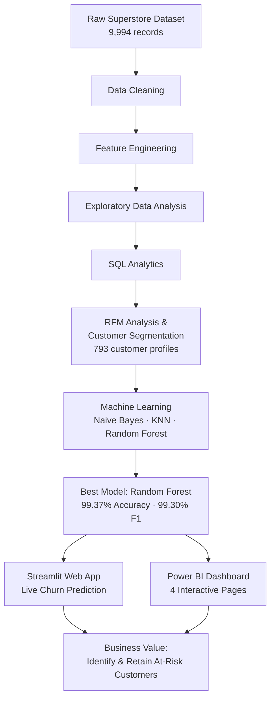

# Customer Churn Analytics Platform

An end-to-end data analytics project that predicts customer churn using RFM (Recency, Frequency, Monetary) analysis and machine learning, with results delivered through an interactive Power BI dashboard and a live Streamlit prediction app.


---

## 📌 Project Overview

Customer retention is far cheaper than customer acquisition. This project builds a complete pipeline — from raw transaction data to a deployed prediction tool and executive dashboard — that helps a retail business identify which customers are at risk of churning and why, so retention efforts can be targeted rather than blanket.

## 🎯 Business Problem

The Superstore dataset contains order-level transactions but no direct churn label. The goal was to:
- Convert transaction-level data into customer-level behavioral profiles (RFM)
- Define a measurable, defensible proxy for churn
- Build and compare classification models to predict at-risk customers
- Make the results usable for both technical (Streamlit) and business (Power BI) audiences

## 📊 Dataset

- **Source:** Superstore retail transactions dataset
- **Raw records:** 9,994 order-level transactions
- **After RFM aggregation:** 793 unique customer profiles

## 🛠️ Tech Stack

| Layer | Tools |
|---|---|
| Data Cleaning & Feature Engineering | Python (Pandas, NumPy) |
| EDA & Visualization | Matplotlib, Seaborn |
| Analytics | SQL |
| Machine Learning | scikit-learn (Naive Bayes, KNN, Random Forest) |
| Model Persistence | joblib |
| App Deployment | Streamlit |
| Business Dashboard | Power BI |

## 🔄 Workflow



*(See `Images/architecture-diagram.svg` for a static version of this diagram.)*

## 📁 Folder Structure

```
Customer-Churn-Analytics-Platform/
│
├── Data/                  # Raw and processed datasets
├── Notebooks/             # Jupyter notebooks (EDA, feature engineering, ML)
├── SQL/                   # SQL analysis scripts
├── Models/                # Saved model & scaler (.pkl files)
├── PowerBI/               # .pbix dashboard file
├── Streamlit/             # app.py and Streamlit assets
├── Images/                # Diagrams, dashboard & app screenshots
├── Reports/               # Any supporting write-ups
├── README.md
├── requirements.txt
└── LICENSE
```

## 🧹 Data Cleaning & Feature Engineering

- Handled missing values, duplicates, and data type corrections
- Engineered 8 customer-level features from raw transactions:
  - Recency, Frequency, Monetary
  - R Score, F Score, M Score
  - RFM Score
  - Customer Segment

## 🤖 Machine Learning

Three classification models were trained and compared on the customer-level dataset:

| Model | Accuracy | Precision | Recall | F1-Score | ROC-AUC |
|---|---|---|---|---|---|
| Naive Bayes | 90.57% | 90.14% | 88.89% | 89.51% | 0.9042 |
| K-Nearest Neighbors (KNN) | 91.19% | 95.31% | 84.72% | 89.71% | 0.9064 |
| **Random Forest (best)** | **99.37%** | **100.00%** | **98.61%** | **99.30%** | **0.9931** |

Test set size: 159 customers (87 not-churned, 72 churned).

**Why Random Forest:** it consistently outperformed the other two models across accuracy and F1-score, and handles the mix of scaled numeric RFM features well without heavy tuning.

## 📈 Power BI Dashboard

A 4-page interactive dashboard:
1. **Executive Overview** — high-level KPIs (customers, revenue, churn rate)
2. **Customer Churn Analysis** — churn distribution and drivers
3. **Customer RFM Analysis** — segment breakdown (Champions, At-Risk, etc.)
4. **Sales Performance Analysis** — revenue and order trends

## 💻 Streamlit App

A live web app where a user enters Recency, Frequency, and Monetary values and receives:
- Churn prediction (Churn / Not Churn)
- Prediction probability
- A short business explanation of the result

## 💡 Key Business Insights

> Customize these with your actual notebook findings before publishing — placeholders below are typical RFM-driven insights to guide you.
- A small segment of high-value, frequent customers ("Champions") drives a disproportionate share of revenue
- Customers with high recency (long time since last order) show a sharply higher churn rate
- At-risk customers can be identified before they fully disengage, enabling proactive retention offers

## ⚠️ Project Limitation

The original dataset did not contain a customer churn label. A **proxy churn label** was created using customer recency (customers inactive for more than 90 days were labeled churned). The high model accuracy reflects this proxy definition and should be interpreted in that context — not as ground-truth churn prediction. This is a documented, intentional trade-off given the dataset available.

## 🔮 Future Improvements

- Train on a dataset with true churn labels (subscription or contract-based business)
- Add SHAP-based explainability for individual predictions
- Track and report Streamlit prediction latency
- Deploy the Streamlit app publicly (Streamlit Community Cloud)
- Add automated retraining pipeline

## 🖼️ Screenshots

> Add screenshots to `Images/` and reference them here, e.g.:
```


```

## ⚙️ Setup & Usage

```bash
# Clone the repo
git clone https://github.com/rumman49/Customer-Churn-Analytics-Platform.git
cd Customer-Churn-Analytics-Platform

# Install dependencies
pip install -r requirements.txt

# Run the Streamlit app
streamlit run Streamlit/app.py
```

## 👤 Author

**Romaan Uddin Siddiqui**
[GitHub](https://github.com/rumman49) · [LinkedIn](#) · [Instagram](https://instagram.com/rumman_siddiqui_46)

## 📄 License

This project is licensed under the MIT License — see the [LICENSE](LICENSE) file for details.
